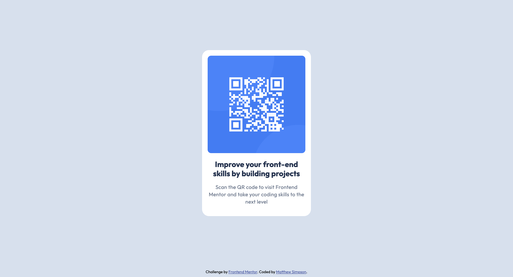

# Frontend Mentor - QR code component solution

This is a solution to the [QR code component challenge on Frontend Mentor](https://www.frontendmentor.io/challenges/qr-code-component-iux_sIO_H). Frontend Mentor challenges help you improve your coding skills by building realistic projects. 

## Table of contents

- [Overview](#overview)
  - [Screenshot](#screenshot)
  - [Links](#links)
- [My process](#my-process)
  - [Built with](#built-with)
  - [What I learned](#what-i-learned)
  - [Continued development](#continued-development)
  - [Useful resources](#useful-resources)
- [Author](#author)
- [Acknowledgments](#acknowledgments)

## Overview

### Screenshot

### Links

- Solution URL: [Github Repo](https://github.com/s2i61m97o/qr-code-component.git)
- Live Site URL: [Live Site](https://s2i61m97o.github.io/qr-code-component/)

## My process

### Built with

- Semantic HTML5 markup
- CSS custom properties
- Flexbox

### What I learned

Flexbox is a useful layout tool even if the dynamic function it is widely used for is not a primary concern. Using flexbox in this challenge allowed me to quickly and easily center align - both vertically and horizontally - the entire qr-card to the center of the page. 

One of the key things I learnt from this challenge is the use of Figma design files and how to retrieve the required information from those files to allow an accurate copy of the design needs. 

### Continued development

I will be continuing to learn and develop my understanding of flexbox to able to use it within coming projects as well as continuing to understand more complex Figma design files.

### Useful resources

- [CSS Tricks Flexbox Guide](https://css-tricks.com/snippets/css/a-guide-to-flexbox/) - This helped me understand how to use flexbox for layout purposes.

## Author

- Frontend Mentor - [@s2i61m97o](https://www.frontendmentor.io/profile/s2i61m97o)
